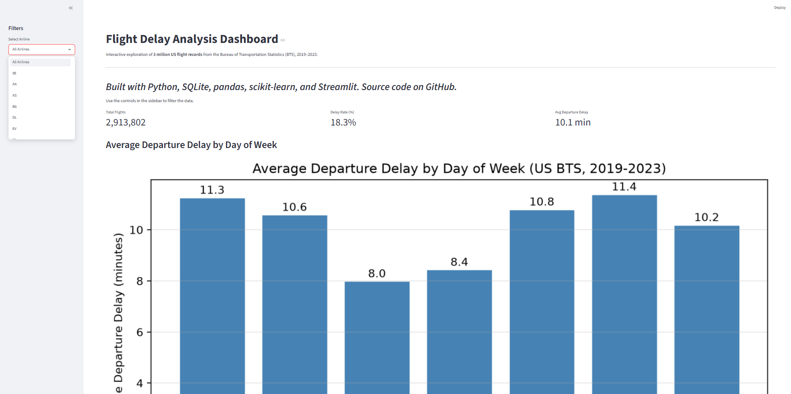
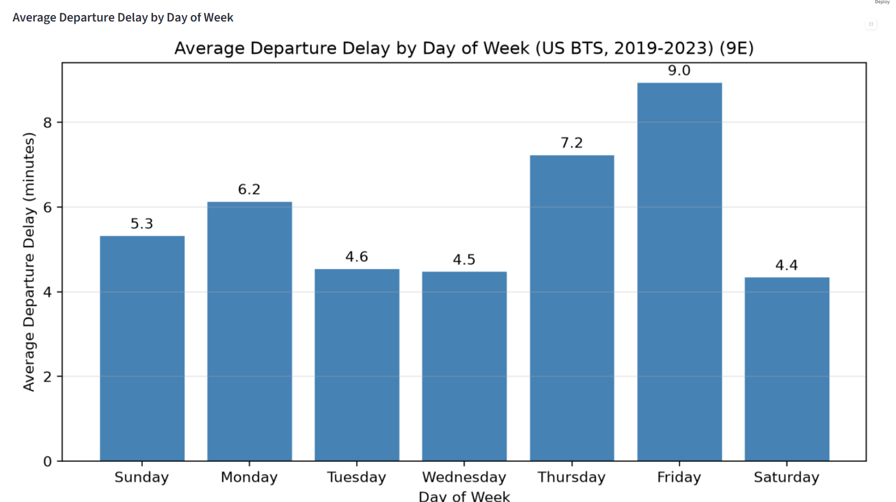
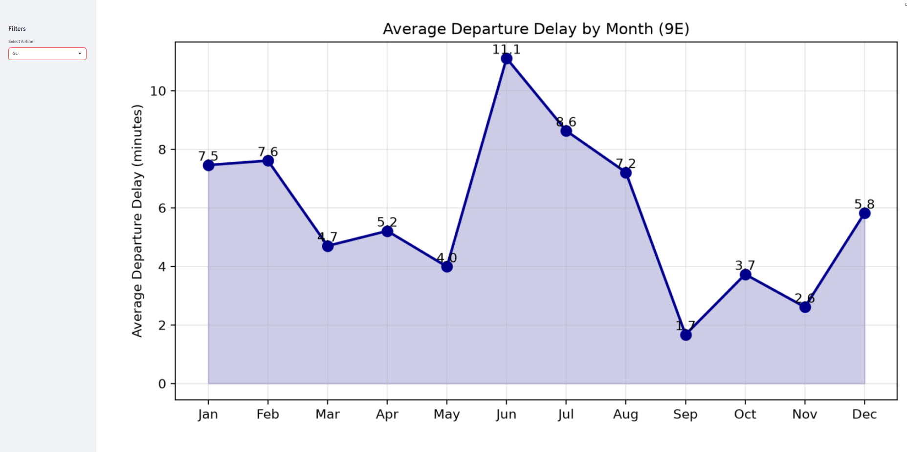

# Flight Delay Analysis

Statistical analysis and predictive modeling of US flight delays using 3 million Bureau of Transportation Statistics (BTS) records from 2019-2023.

## Overview

This project explores patterns in US domestic flight delays through SQL analysis, statistical hypothesis testing, predictive modeling, and an interactive dashboard. Built as a portfolio project demonstrating end-to-end data analytics work from raw data to deployed insights.

## Tech Stack

- **Python** — pandas, scipy, scikit-learn, matplotlib
- **SQL** — SQLite for local analysis, queries compatible with production databases (Snowflake, Oracle, SQL Server)
- **Streamlit** — interactive dashboard
- **Jupyter** — analysis notebooks

## Dataset

US Bureau of Transportation Statistics On-Time Performance data, 3M flight sample spanning 2019-2023. Source: Kaggle (publicly available BTS data).

The raw CSV (614 MB) and SQLite database (472 MB) are not committed to this repository. To reproduce, download the dataset from [Kaggle](https://www.kaggle.com/datasets/patrickzel/flight-delay-and-cancellation-dataset-2019-2023) and place it at `data/raw/flights_sample_3m.csv`.

## Repository Structure

## Key Findings

1. **Average delay is misleading.** Mean departure delay is ~10 minutes, but median is -3 minutes. Delays follow a right-skewed distribution with most flights on-time and a long tail of severe delays.

2. **Weekend vs weekday delays are statistically significant but practically negligible.** Welch's t-test on 2.9M flights returned p < 10⁻⁴⁰, but Cohen's d = 0.018 — a meaningless effect size despite the large sample.

3. **The 2020 COVID effect is visible in the data.** March-April 2020 had a 24.94% cancellation rate vs 0.87%-2.21% in other years.

4. **Late-arriving aircraft is the largest single delay cause** (~25 min average), followed by carrier-caused delays (~25 min), with weather contributing only ~4 minutes on average.

5. **Predictive modeling with scheduling-time features is weak.** A logistic regression model achieved ROC AUC of 0.64 — real signal but limited. Production delay prediction requires real-time operational data (weather, congestion, inbound aircraft status) not in this dataset.

## Methods

### SQL Analysis

7 queries against a SQLite database covering: worst airlines, worst airports (with sample-size sensitivity analysis), day-of-week patterns, delay cause breakdown, monthly seasonality, and cancellation rates.

### Statistical Testing

Welch's two-sample t-test comparing weekend vs weekday departure delays, with practical significance assessment via Cohen's d.

### Predictive Modeling

Logistic regression with balanced class weights predicting whether a flight will be delayed by 15+ minutes. Features: airline, origin, destination, day of week, month, scheduled hour. One-hot encoded categorical features, stratified 80/20 train/test split, evaluated with precision, recall, F1, ROC AUC.

### Interactive Dashboard

Streamlit app with sidebar airline filter, key metrics row, and responsive charts for day-of-week and monthly delay patterns.

## Dashboard Preview

The interactive Streamlit dashboard supports filtering by airline, with metrics and charts updating based on user selection.

The sidebar dropdown lists 18 airlines with 10,000+ flights in the dataset. Selecting an airline updates the metrics row (total flights, delay rate, average delay) and both charts.

Switching airlines reveals different operational patterns — for example, regional carriers like Endeavor (9E) show different seasonal behavior than major hubs.

## Running Locally

1. Clone the repository
2. Create a virtual environment and install dependencies:
   python -m venv venv
   source venv/bin/activate # On Windows: .\venv\Scripts\Activate.ps1
   pip install -r requirements.txt
3. Download the BTS dataset (see [Dataset](#dataset)) and place it at `data/raw/flights_sample_3m.csv`
4. Run the notebooks in order (01 through 04) to build the database and run the analysis
5. Launch the dashboard: streamlit run dashboard/app.py

## Limitations & Future Work

- Predictive model uses only scheduling-time features; real-time operational data would significantly improve performance
- Dataset is US BTS data; analysis methods apply identically to Canadian or international datasets
- Dashboard could be extended with predictive model integration and route-level analysis
- Future iterations could explore gradient boosting models and threshold tuning for business-specific precision/recall tradeoffs

## Author

Elias Nasrallah  
Software Engineering Co-op Student, Concordia University  
[LinkedIn](https://linkedin.com/in/eliasnasrallah313) | [GitHub](https://github.com/Eliasn20)
